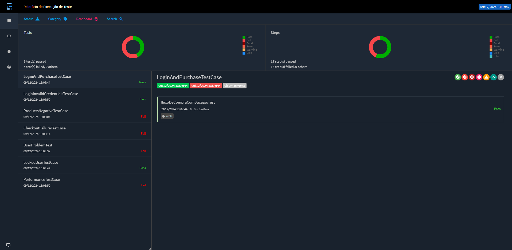

## Desafio Técnico DBServer


### [Sauce Demo](https://www.saucedemo.com/v1/index.html)

> _O site apresenta uma interface simples de e-commerce, permitindo a realização de tarefas como login, navegação por produtos, adição de itens ao carrinho e finalização de compras._
> 
> _É utilizado para práticas de teste de software, fornecido pela Sauce Labs, uma plataforma que permite simular diferentes cenários em ambientes web_

---

### :clipboard: Visão Geral

Este projeto foi desenvolvido exclusivamente para [DBServer](https://db.tec.br/) e tem como objetivo demonstrar competências em testes de software, abrangendo cenários, casos de teste, BDDs e detecção de bugs.

---

### :open_file_folder: Estrutura do Projeto

#### :bookmark_tabs: Cenários e Casos de Teste:

:small_blue_diamond:[Suace Demo Table](documents/scenarios/Cenarios%20de%20Sauce%20Demo.xlsx)   

#### :bookmark_tabs: BDDs:
:small_blue_diamond:[Login and Purchase](documents/BDDs/LoginAndPurchase.md)

:small_blue_diamond:[Login](documents/BDDs/Login.md)

:small_blue_diamond:[Products - Your Cart](documents/BDDs/Products.md)

:small_blue_diamond:[Checkout - Finish](documents/BDDs/Checkout_Finish.md)

:small_blue_diamond:[Locked User](documents/BDDs/LockedUser.md)

#### :bookmark_tabs: Bugs:
:small_blue_diamond: [Manual Testing](documents/bugs/manual%20testing/Descrição%20e%20o%20título%20do%20produto%20-%20BUG.pdf)

:small_blue_diamond: [Products - Your Cart](documents/bugs/product_your%20cart)

:small_blue_diamond: [Checkout - Finish](documents/bugs/checkout_finish)

:small_blue_diamond: [Problem User](documents/bugs/problem_user)

:small_blue_diamond: [Performance User](documents/bugs/performance_user)
    

---

### :wrench: Tecnologias e Ferramentas Utilizadas

#### Estrutura:

:pushpin: [MAVEN](https://maven.apache.org/download.cgi) - Gerenciador de dependências e automação de build.
    
:pushpin: [JAVA 17](https://www.oracle.com/java/technologies/javase/jdk17-archive-downloads.html) - Linguagem de programação principal do projeto.
    

#### Dependências:

:pushpin: [TestNG](https://mvnrepository.com/artifact/org.testng/testng/7.10.2) - Framework de teste.
    
:pushpin: [Selenium Java](https://mvnrepository.com/artifact/org.seleniumhq.selenium/selenium-java/4.27.0) - Automatação de testes para aplicações web.
    
:pushpin: [WebDriverManager](https://mvnrepository.com/artifact/io.github.bonigarcia/webdrivermanager/5.9.2) - Gerenciamento de drivers do navegador.
    
:pushpin: [Extent Reports TestNG Adapter](https://mvnrepository.com/artifact/com.aventstack/extentreports-testng-adapter/1.0.3) - Geração de relatórios de execução.
    
:pushpin: [Java Faker](https://mvnrepository.com/artifact/com.github.javafaker/javafaker/1.0.2) - Geração de dados fictícios para testes.
    
:pushpin: [Lombok](https://mvnrepository.com/artifact/org.projectlombok/lombok/1.18.36) - Redução de boilerplate no código.
    
---

### :computer: Como Executar o Projeto

#### Clonando o Repositório:

Execute o seguinte comando em seu terminal ou utilize sua IDE favorita:

```
git clone https://github.com/loopfagundes/db_desafio.git
```

#### Executando os Testes:

Para rodar os testes localmente, utilize os comandos abaixo:

```
mvn clean
```

```
mvn test
```

Por padrão, os testes serão executados no navegador Chrome. Para alternar para outros navegadores (Firefox ou Edge), edite o seguinte arquivo:

```
src/main/java/com.saucedemo/utils/BaseTest
```

```
@BeforeMethod
DriverFactory.createInstance(BrowserEnum.CHROME);
```

Substitua `BrowserEnum.CHROME` por `BrowserEnum.FIREFOX` ou `BrowserEnum.EDGE`, conforme sua necessidade.

---

#### Relatórios:

Após a execução, os relatórios de teste podem ser acessados:

1. Navegue até a pasta `report`.
    
2. Abra o arquivo `report.html`.
    
3. No IntelliJ IDEA:
    - Clique com o botão direito do mouse, selecione `Open in`, e escolha o navegador desejado.

4. No VSCode:
    - Clique com o botão direito do mouse, selecione `Reveal in File Explorer`, e uma janela da pasta será aberta. Clique no arquivo report.html para visualizá-lo.

---    

#### Screenshot:


---

### :memo: Observações Finais

Projeto realizado com muito empenho, acompanhando o processo de detecção de bugs, levantamento de cenários e construção de testes automatizados.

---
Feito com bug, café e muito esforço :beetle::coffee: